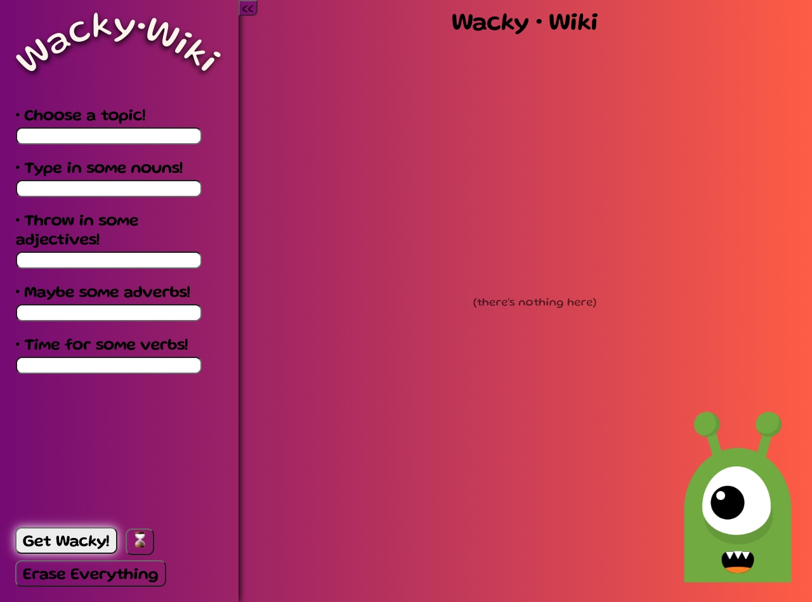
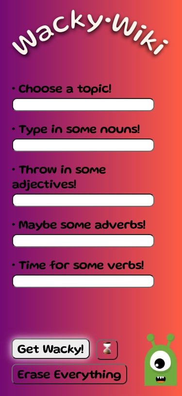

Woohoo! **WackyWiki**
=======
Visit [HERE](https://evanhosni.github.io/wackywiki/ "Website for the WackyWiki Project") to start ~~getting~~ **[Verb]** **WACKY**.

 Most ~~Awesomest~~ **[Adjective]** spin on the classic 90's nostalgic roadtrip banger.. MadLibz
==
**WackyWiki** is a very user friendly online version of ~~MadLibz~~ **[Noun]** that allows you to select any topic from Wikipedia and input how ever many and whatever zany nouns, adjectives, verbs, and adverbs you would like, to randomly replace words in the article.

Boring parts
===
The `code` is here on github.

**Awesome** parts
===
THE WHOLE ~~&@$#ING*~~ **[Expletive]** THING!!

Credits
==

- [Evan Hosni](https://github.com/evanhosni) - Git Admin/Mastermind of Concept

- [Lindsay Fitzgerald](https://github.com/lindsfitz) - Project Manager/Wrinkly Brainer

- [Juan Diego Lanata](https://github.com/JDLanata) - Senior Researcher/Troubleshooter

- [David Siegmann](https://github.com/DavidSiegmann) - Junior Researcher/Comedic Relief

## Mock-Up

Images of the appearance of the website:

  
  

Resources
=
- [Wikipedia API](https://en.wikipedia.org/wiki/Wikipedia:API)
- [WordPOS API](https://www.npmjs.com/package/wordpos)
- [Wacky Wilfred](https://scotch.io/bar-talk/build-an-eye-tracking-alien-with-javascript-solution-to-code-challenge-4)

